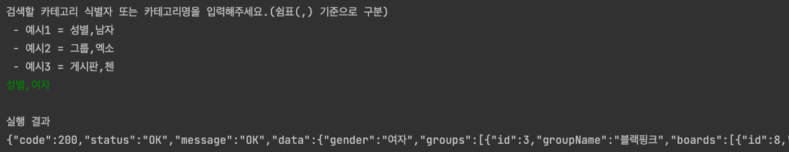

# 코딩테스트

* java 17
* Spring Boot 3.2.5
* Gradle

## 목차

- [코드 실행](#코드-실행)

## 코드 실행

* 문제1
  * hanteo.hanteotest.test1.Test1Runner를 실행합니다.
  * 실행 후 입력 조건에 맞춰서 정보를 입력하면 결과가 JSON 텍스트로 출력됩니다.  
    
* 문제2
  * hanteo.hanteotest.test2.Test2Runner를 실행합니다.
  * 실행 후 입력 조건에 맞춰서 정보를 입력하면 결과가 출력됩니다.  
    